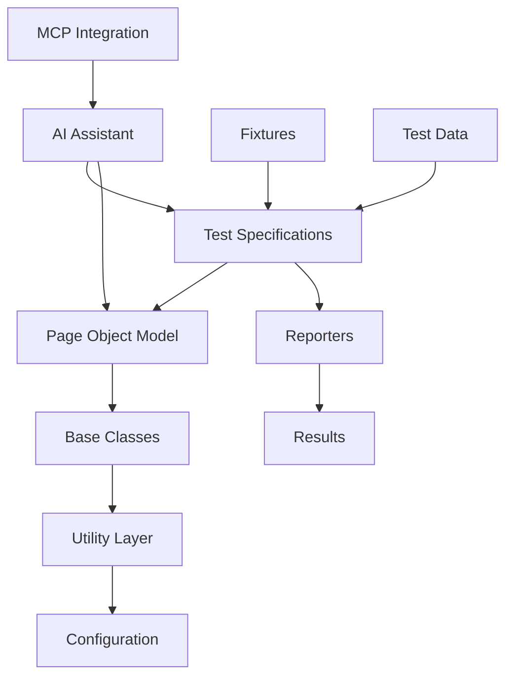

# 🎭 Playwright Test Automation Framework

> **A next-generation, AI-enhanced test automation framework built with TypeScript and Playwright, featuring advanced MCP integration, scalable architecture, and intelligent test generation capabilities.**

[](https://www.typescriptlang.org/)
[](https://playwright.dev/)
[](https://nodejs.org/)
[](https://github.com/microsoft/playwright)

## 📋 Table of Contents

- [🎯 Framework Overview](#-framework-overview)
- [🏗️ Architecture & Design](#️-architecture--design)
- [✨ Key Features](#-key-features)
- [🚀 Advantages](#-advantages)
- [🤖 AI Integration & Usage](#-ai-integration--usage)
- [🔧 Playwright MCP Integration](#-playwright-mcp-integration)
- [🎨 Customization](#-customization)
- [📊 Reporting](#-reporting)
- [📈 Scalability](#-scalability)
- [🔮 Enhancement Roadmap](#-enhancement-roadmap)
- [🚀 Getting Started](#-getting-started)
- [⚙️ GitHub Actions Integration](#️-github-actions-integration)
- [📖 Usage Examples](#-usage-examples)

---

## 🎯 Framework Overview

This is a comprehensive, enterprise-grade test automation framework designed for modern web applications, API testing, and document management systems like Document360. Built with TypeScript and Playwright, it incorporates cutting-edge AI assistance and Model Context Protocol (MCP) integration for intelligent test creation and maintenance.

### 🎯 Target Applications
- **Document360 Portal**: Complete project management and API documentation workflows
- **Web Applications**: Modern SPAs, PWAs, and traditional web apps
- **API Services**: RESTful APIs, GraphQL endpoints, and microservices
- **Cross-Platform**: Desktop, mobile, and hybrid applications

---

## 🏗️ Architecture & Design

### 🏛️ Core Architecture Principles



### 📁 Directory Structure

```
playwright-fw/
├── 📁 tests/
│   ├── 📁 apiTests/              # API test specifications
│   │   ├── authenticationTest.spec.ts
│   │   ├── createLibrary.spec.ts
│   │   └── 📁 endPointsDTO/      # API endpoints & DTOs
│   ├── 📁 uiTests/               # UI test specifications  
│   │   ├── 📁 e2e/               # End-to-end test scenarios
│   │   └── 📁 pageObjects/       # Page Object Model classes
│   ├── 📁 fixtures/              # Test fixtures & base classes
│   ├── 📁 utils/                 # Utility classes & helpers
│   ├── 📁 data/                  # Test data & configurations
│   └── 📁 commonUtils/           # Shared utilities
├── 📁 testConfig/                # Environment configurations
├── 📁 test-results/              # Test execution artifacts
│   ├── 📁 reports/               # Enhanced HTML reports
│   ├── 📁 screenshots/           # Failure screenshots
│   └── 📁 videos/                # Test execution videos
└── 📁 docs/                      # Framework documentation
```

### 🎨 Design Patterns

1. **Page Object Model (POM)**: Encapsulates UI elements and actions
2. **Factory Pattern**: Dynamic test data generation
3. **Builder Pattern**: Fluent API for complex configurations
4. **Strategy Pattern**: Multiple authentication strategies
5. **Observer Pattern**: Event-driven test reporting

---

## ✨ Key Features

### 🌟 Core Capabilities

| Feature | Description | Status |
|---------|-------------|---------|
| **Cross-Browser Testing** | Chrome, Firefox, Safari, Edge support | ✅ Implemented |
| **API & UI Testing** | Unified framework for all test types | ✅ Implemented |
| **AI-Assisted Development** | Intelligent test generation and maintenance | ✅ Implemented |
| **Visual Testing** | Screenshot comparison and visual regression | ✅ Implemented |
| **Parallel Execution** | Multi-worker test execution | ✅ Implemented |
| **Enhanced Reporting** | Advanced analytics via `playwright-enhanced-reporter` | ✅ Implemented |
| **Real-time Reporting** | Live test results and analytics | ✅ Implemented |
| **Auto-healing** | Self-repairing test locators | 🔄 In Progress |
| **Cloud Integration** | CI/CD pipeline integration | ✅ Implemented |

### 🔧 Technical Features

- **TypeScript Support**: Full type safety and IntelliSense
- **Dynamic Locators**: Self-adapting element identification
- **Response Validation**: Comprehensive API response checking
- **Error Handling**: Robust exception management with screenshots
- **Test Data Management**: Environment-specific data handling
- **Authentication Manager**: Multi-strategy login handling
- **Logging System**: Detailed execution logging with levels

---

## 🚀 Advantages

### 💪 Framework Strengths

#### 1. **Developer Experience**
- **Zero Configuration**: Works out-of-the-box with minimal setup
- **IntelliSense Support**: Full TypeScript integration for better coding
- **Hot Reload**: Instant test updates during development
- **Debugging Tools**: Built-in debugging and troubleshooting

#### 2. **Reliability & Stability**
- **Auto-Wait Mechanisms**: Intelligent waiting for elements
- **Retry Logic**: Configurable retry strategies for flaky tests
- **Error Recovery**: Automatic error handling and recovery
- **Isolation**: Each test runs in clean browser context

#### 3. **Performance**
- **Parallel Execution**: Run tests across multiple workers
- **Efficient Resource Usage**: Optimized browser management
- **Fast Test Execution**: Lightweight test runner
- **Caching**: Smart caching for improved speed

#### 4. **Maintainability**
- **Page Object Model**: Clean separation of concerns
- **Reusable Components**: Modular test architecture
- **Version Control**: Git-friendly test artifacts
- **Documentation**: Auto-generated test documentation

#### 5. **Enterprise Ready**
- **Scalable Architecture**: Handles large test suites
- **CI/CD Integration**: Seamless pipeline integration
- **Security**: Secure credential management
- **Compliance**: Audit trails and reporting

---

## 🤖 AI Integration & Usage

### 🧠 AI-Powered Features

The framework leverages advanced AI capabilities through multiple integration points:

#### 1. **GitHub Copilot Integration**
```typescript
// AI-assisted test generation
test('AI-generated user workflow test', async ({ 
  dashboardPage, 
  projectManagementPage 
}) => {
  // Copilot suggests complete test flows based on context
  await dashboardPage.navigateToDashboard();
  await dashboardPage.setProjectName('AutoAssignmetAPI');
  await dashboardPage.clickProjectSettings();
});
```

#### 2. **Intelligent Locator Generation**
- **Context-Aware**: AI analyzes page structure for optimal locators
- **Self-Healing**: Automatically adapts to UI changes
- **Semantic Understanding**: Uses content context for element identification

#### 3. **Test Data Generation**
```typescript
// AI-powered test data generation
const testData = await TestDataGenerator.generateUserData({
  scenario: 'project_creation',
  complexity: 'advanced',
  aiAssisted: true
});
```

#### 4. **Failure Analysis**
- **Root Cause Detection**: AI analyzes failures and suggests fixes
- **Pattern Recognition**: Identifies recurring issues
- **Auto-Remediation**: Suggests code improvements

### 🎯 AI Usage Scenarios

1. **Test Creation**: Generate complete test scenarios from requirements
2. **Maintenance**: Auto-update tests when UI changes
3. **Debugging**: Intelligent error analysis and solutions
4. **Optimization**: Performance tuning recommendations
5. **Coverage Analysis**: Identify test gaps and suggest improvements

---

## 🔧 Playwright MCP Integration

### 🌐 Model Context Protocol (MCP) Features

The framework includes advanced MCP integration for enhanced browser automation:

#### 1. **Browser Management**
```typescript
// MCP-enhanced browser operations
await mcp_playwright_browser_navigate({ 
  url: 'https://document360.com/dashboard' 
});

await mcp_playwright_browser_snapshot(); // Smart page analysis
await mcp_playwright_browser_click({ 
  element: 'Project Settings Button',
  ref: 'dynamic-locator-ref' 
});
```

#### 2. **Intelligent Element Interaction**
- **Smart Clicking**: Context-aware element clicking
- **Form Filling**: Intelligent form completion
- **File Uploads**: Seamless file handling
- **Drag & Drop**: Advanced interaction support

#### 3. **Visual Testing**
- **Screenshot Comparison**: Pixel-perfect visual testing
- **Element Screenshots**: Targeted visual validation
- **Responsive Testing**: Multi-viewport validation

#### 4. **Network Monitoring**
```typescript
// MCP network request monitoring
const requests = await mcp_playwright_browser_network_requests();
const consoleMessages = await mcp_playwright_browser_console_messages();
```

### 🔄 MCP Workflow Integration

1. **Page Analysis**: MCP analyzes page structure and suggests interactions
2. **Action Planning**: AI plans optimal user workflows
3. **Execution**: MCP executes actions with intelligent waiting
4. **Validation**: Automatic validation of expected outcomes
5. **Reporting**: Enhanced reporting with MCP insights

---

## 🎨 Customization

### ⚙️ Configuration Options

#### 1. **Environment Configuration**
```typescript
// testConfig/globalSetup.ts
export const environments = {
  dev: {
    baseURL: 'https://dev.document360.com',
    timeout: 30000,
    retries: 2
  },
  qa: {
    baseURL: 'https://qa.document360.com',
    timeout: 45000,
    retries: 3
  }
};
```

#### 2. **Custom Page Objects**
```typescript
// Extend base page object
export class CustomDashboardPage extends DashboardPage {
  async customWorkflow(): Promise<void> {
    await this.setProjectName('CustomProject');
    await this.clickProjectSettings();
    // Add custom logic here
  }
}
```

#### 3. **Custom Utilities**
```typescript
// utils/CustomValidators.ts
export class CustomValidators {
  static async validateProjectStructure(data: any): Promise<boolean> {
    // Custom validation logic
    return true;
  }
}
```

#### 4. **Test Fixtures**
```typescript
// fixtures/customFixtures.ts
export const customTest = baseTest.extend<{
  customPage: CustomDashboardPage;
}>({
  customPage: async ({ page }, use) => {
    const customPage = new CustomDashboardPage(page);
    await use(customPage);
  }
});
```

### 🎛️ Advanced Customization

1. **Custom Reporters**: Create specialized reporting formats
2. **Plugin System**: Extend framework capabilities
3. **Theme Support**: Customize UI and reporting appearance
4. **Localization**: Multi-language test support
5. **Integration Hooks**: Custom CI/CD integration points

---

## 📊 Reporting

### 📈 Multi-Tier Reporting System

#### 1. **HTML Reports**
- **Interactive Dashboard**: Real-time test results
- **Drill-down Analytics**: Detailed failure analysis
- **Visual Timeline**: Test execution flow
- **Screenshots & Videos**: Full failure context

#### 2. **JUnit XML Reports**
```xml
<!-- junit.xml integration for CI/CD -->
<testsuites>
  <testsuite name="Project Management Tests" tests="5" failures="0">
    <testcase name="Create API Project" time="15.234"/>
  </testsuite>
</testsuites>
```

#### 3. **Custom Enhanced Reports**
```typescript
// Enhanced reporting with AI insights
export class EnhancedReporter {
  async generateReport(): Promise<void> {
    const report = {
      summary: this.generateSummary(),
      aiInsights: await this.getAIAnalysis(),
      recommendations: this.getRecommendations(),
      trends: this.analyzeTrends()
    };
  }
}
```

#### 4. **Playwright Enhanced Reporter**
This framework leverages the custom [`playwright-enhanced-reporter`](https://www.npmjs.com/package/playwright-enhanced-reporter) package, specifically designed to provide advanced reporting capabilities:

```bash
# Install the enhanced reporter
npm install playwright-enhanced-reporter
```

**Key Features:**
- **📊 Rich Visual Reports**: Enhanced HTML reports with interactive charts and graphs
- **🎯 Test Analytics**: Advanced metrics and performance analysis
- **🚀 CI/CD Integration**: Seamless integration with GitHub Actions and other CI/CD platforms
- **📱 Multi-format Output**: HTML, JSON, and custom formats
- **🔍 Deep Insights**: Detailed test execution analysis with actionable recommendations
- **📈 Trend Analysis**: Historical performance tracking and regression detection

**Configuration Example:**
```typescript
// playwright.config.ts
import { defineConfig } from '@playwright/test';
import { EnhancedReporter } from 'playwright-enhanced-reporter';

export default defineConfig({
  reporter: [
    ['html'],
    ['junit', { outputFile: 'test-results/junit.xml' }],
    [EnhancedReporter, {
      outputDir: 'enhanced-reports',
      openReport: process.env.CI ? false : true,
      includeMetrics: true,
      generateCharts: true,
      aiInsights: true
    }]
  ],
  // ... other config
});
```

**Sample Enhanced Report Output:**
```json
{
  "summary": {
    "total": 47,
    "passed": 45,
    "failed": 2,
    "duration": "2m 34s",
    "efficiency": "95.7%"
  },
  "insights": {
    "performanceScore": 8.5,
    "reliability": "High",
    "recommendations": [
      "Consider optimizing login flow - avg 3.2s",
      "API response validation could be enhanced"
    ]
  },
  "trends": {
    "improvement": "+12% from last run",
    "regressions": ["Dashboard load time increased by 500ms"]
  }
}
```

### 📊 Reporting Features

| Feature | Description | Format | Source |
|---------|-------------|--------|--------|
| **Execution Summary** | High-level test results overview | HTML, JSON | Playwright + Enhanced Reporter |
| **Failure Analysis** | Detailed error breakdown | HTML, Screenshots | Playwright + Enhanced Reporter |
| **Performance Metrics** | Test execution timing | Charts, Graphs | Enhanced Reporter |
| **Trend Analysis** | Historical test performance | Dashboard | Enhanced Reporter |
| **AI Insights** | Intelligent failure analysis | Natural Language | Enhanced Reporter |
| **Custom Analytics** | Advanced test metrics and KPIs | Interactive Charts | Enhanced Reporter |
| **Regression Detection** | Automated performance regression alerts | JSON, Notifications | Enhanced Reporter |

### 📱 Report Integrations

- **Slack**: Real-time notifications
- **Email**: Automated report delivery
- **Teams**: Collaborative result sharing
- **Jira**: Automatic issue creation
- **Dashboard**: Live monitoring

---

## 📈 Scalability

### 🏗️ Scalability Architecture

#### 1. **Horizontal Scaling**
```typescript
// playwright.config.ts
export default {
  workers: process.env.CI ? 4 : 2, // Dynamic worker allocation
  projects: [
    { name: 'chromium', use: { ...devices['Desktop Chrome'] } },
    { name: 'firefox', use: { ...devices['Desktop Firefox'] } },
    { name: 'webkit', use: { ...devices['Desktop Safari'] } }
  ]
};
```

#### 2. **Test Organization**
- **Modular Structure**: Independent test modules
- **Parallel Execution**: Multi-worker test running
- **Load Balancing**: Intelligent test distribution
- **Resource Management**: Optimized browser allocation

#### 3. **Cloud Integration**
- **Docker Support**: Containerized test execution
- **Kubernetes**: Scalable cloud deployment
- **CI/CD Pipelines**: Automated scaling
- **Cloud Browsers**: Remote execution capabilities

### 📊 Performance Optimization

#### 1. **Execution Optimization**
- **Smart Batching**: Optimal test grouping
- **Resource Pooling**: Efficient browser reuse
- **Caching**: Intelligent artifact caching
- **Lazy Loading**: On-demand resource loading

#### 2. **Memory Management**
- **Garbage Collection**: Optimized memory usage
- **Context Isolation**: Clean test separation
- **Resource Cleanup**: Automatic cleanup routines

### 🌍 Enterprise Scaling

1. **Multi-Environment**: Parallel testing across environments
2. **Team Collaboration**: Multi-team test management
3. **Resource Allocation**: Dynamic resource distribution
4. **Monitoring**: Real-time performance monitoring
5. **Auto-scaling**: Demand-based scaling

---

## 🔮 Enhancement Roadmap

### 🚀 Upcoming Features


- [ ] **Advanced AI Integration**
  - GPT-4 powered test generation
  - Natural language test creation
  - Intelligent test maintenance


- [ ] **Enhanced MCP Features**
  - Advanced browser automation
  - Smart element discovery
  - Predictive testing


- [ ] **Cloud-Native Features**
  - Kubernetes-native execution
  - Serverless test runners
  - Global test distribution


- [ ] **Advanced Analytics**
  - ML-powered test insights
  - Predictive failure analysis
  - Performance optimization AI

### 🔧 Technical Enhancements

1. **Auto-Healing Tests**: Self-repairing test locators
2. **Visual AI**: Advanced visual testing capabilities  
3. **Performance Testing**: Integrated load testing
4. **API Mocking**: Built-in service virtualization
5. **Test Generation**: Requirements-to-tests automation

### 📊 Reporting Enhancements

1. **Real-time Dashboards**: Live test monitoring
2. **Predictive Analytics**: Failure prediction models
3. **Custom Integrations**: Third-party tool connectors
4. **Advanced Visualizations**: Interactive charts and graphs

---

## 🚀 Getting Started

### 📋 Prerequisites

- **Node.js** 18+ 
- **npm** or **yarn**
- **Git**
- **VS Code** (recommended)

### ⚡ Quick Setup

```bash
# 1. Clone the repository
git clone <repository-url>
cd playwright-fw

# 2. Install dependencies
npm install

# 3. Install Playwright browsers
npx playwright install

# 4. Setup environment
cp tests/data/dev.json tests/data/.env
# Edit .env with your credentials

# 5. Run sample tests
npm run test:ui
```

### 🔧 Environment Configuration

```json
// tests/data/qa.json
{
  "baseURL": "https://app.document360.com",
  "credentials": {
    "email": "your-email@domain.com",
    "password": "your-password"
  },
  "timeout": 30000,
  "retries": 3
}
```

### 🏃‍♂️ Running Tests

```bash
# Development environment
npm run test:dev

# Headless mode
npm run test:dev:headless  

# UI tests only
npm run test:ui

# API tests only  
npm run test:api

# Debug mode
npm run test:debug

# Specific test file
npx playwright test tests/uiTests/e2e/projectManagement.spec.ts
```

---

## ⚙️ GitHub Actions Integration

### 🚀 CI/CD Pipeline Overview

Our framework includes a robust GitHub Actions workflow that provides comprehensive automated testing across multiple environments, browsers, and test suites. The workflow is designed for enterprise-grade reliability with advanced features including manual triggers, dynamic matrix builds, and comprehensive reporting.

### 📋 Workflow Features

| Feature | Description | Status |
|---------|-------------|---------|
| **Multi-Environment Support** | QA, Staging, Production environments | ✅ Implemented |
| **Cross-Browser Testing** | Chrome, Firefox, Safari, Edge | ✅ Implemented |
| **Dynamic Test Suites** | Smoke, Regression, E2E, API tests | ✅ Implemented |
| **Manual Triggers** | On-demand test execution | ✅ Implemented |
| **Scheduled Runs** | Daily automated testing | ✅ Implemented |
| **Artifact Management** | Screenshots, videos, reports | ✅ Implemented |
| **Slack Notifications** | Real-time status updates | ✅ Implemented |
| **Parallel Execution** | Optimized test performance | ✅ Implemented |

### 🔧 Workflow Configuration

The main workflow file is located at `.github/workflows/playwright-tests.yml`:

```yaml
name: 🎭 Playwright Test Suite

on:
  # Manual trigger with options
  workflow_dispatch:
    inputs:
      environment:
        description: 'Target environment'
        required: true
        default: 'qa'
        type: choice
        options:
          - qa
          - staging
          - production
      browser:
        description: 'Browser to test'
        required: true
        default: 'chromium'
        type: choice
        options:
          - chromium
          - firefox
          - webkit
          - all
      test_suite:
        description: 'Test suite to run'
        required: true
        default: 'smoke'
        type: choice
        options:
          - smoke
          - regression
          - e2e
          - api
          - all
      run_type:
        description: 'Execution mode'
        required: true
        default: 'headless'
        type: choice
        options:
          - headless
          - headed

  # Automated triggers
  push:
    branches: [main, develop, feature/*, release/*]
    paths:
      - 'tests/**'
      - 'playwright.config.ts'
      - 'package.json'
      - '.github/workflows/**'
  
  pull_request:
    branches: [main, develop]
    paths:
      - 'tests/**'
      - 'playwright.config.ts'
      - 'package.json'
  
  # Daily scheduled run
  schedule:
    - cron: '0 6 * * 1-5'  # Weekdays at 6 AM UTC

jobs:
  test:
    timeout-minutes: 60
    runs-on: ubuntu-latest
    strategy:
      fail-fast: false
      matrix:
        browser: [chromium, firefox, webkit]
        environment: [qa]
        
    steps:
      - name: 🚀 Checkout Repository
        uses: actions/checkout@v4

      - name: 📦 Setup Node.js
        uses: actions/setup-node@v4
        with:
          node-version: '18'
          cache: 'npm'

      - name: 📥 Install Dependencies
        run: npm ci

      - name: 🎭 Install Playwright Browsers
        run: npx playwright install --with-deps

      - name: 🔧 Configure Environment
        run: |
          cp tests/data/${{ matrix.environment }}.json tests/data/.env.json
          echo "Environment configured for: ${{ matrix.environment }}"

      - name: 🧪 Run Playwright Tests
        env:
          BROWSER: ${{ matrix.browser }}
          ENVIRONMENT: ${{ matrix.environment }}
          TEST_SUITE: ${{ github.event.inputs.test_suite || 'smoke' }}
          RUN_TYPE: ${{ github.event.inputs.run_type || 'headless' }}
        run: |
          if [ "$TEST_SUITE" = "smoke" ]; then
            npx playwright test --grep "@smoke" --project=$BROWSER
          elif [ "$TEST_SUITE" = "regression" ]; then
            npx playwright test --grep "@regression" --project=$BROWSER
          elif [ "$TEST_SUITE" = "e2e" ]; then
            npx playwright test tests/uiTests/e2e/ --project=$BROWSER
          elif [ "$TEST_SUITE" = "api" ]; then
            npx playwright test tests/apiTests/ --project=$BROWSER
          else
            npx playwright test --project=$BROWSER
          fi

      - name: 📊 Upload Test Results
        uses: actions/upload-artifact@v4
        if: always()
        with:
          name: playwright-report-${{ matrix.browser }}-${{ matrix.environment }}
          path: |
            playwright-report/
            test-results/
          retention-days: 30

      - name: 🖼️ Upload Screenshots
        uses: actions/upload-artifact@v4
        if: failure()
        with:
          name: screenshots-${{ matrix.browser }}-${{ matrix.environment }}
          path: test-results/screenshots/
          retention-days: 7

      - name: 📹 Upload Videos
        uses: actions/upload-artifact@v4
        if: failure()
        with:
          name: videos-${{ matrix.browser }}-${{ matrix.environment }}
          path: test-results/videos/
          retention-days: 7

  # Notify on completion
  notify:
    needs: test
    runs-on: ubuntu-latest
    if: always()
    steps:
      - name: 📢 Slack Notification
        uses: 8398a7/action-slack@v3
        with:
          status: ${{ job.status }}
          channel: '#qa-automation'
          text: |
            🎭 Playwright Test Suite completed
            Status: ${{ job.status }}
            Environment: ${{ github.event.inputs.environment || 'qa' }}
            Browser: ${{ github.event.inputs.browser || 'chromium' }}
            Suite: ${{ github.event.inputs.test_suite || 'smoke' }}
        env:
          SLACK_WEBHOOK_URL: ${{ secrets.SLACK_WEBHOOK }}
```

### 🎯 Manual Test Execution

#### Via GitHub UI
1. Go to **Actions** tab in your repository
2. Select **🎭 Playwright Test Suite** workflow
3. Click **Run workflow**
4. Configure parameters:
   - **Environment**: qa/staging/production
   - **Browser**: chromium/firefox/webkit/all
   - **Test Suite**: smoke/regression/e2e/api/all
   - **Run Type**: headless/headed
5. Click **Run workflow**

#### Via GitHub CLI
```bash
# Run smoke tests on QA environment
gh workflow run "playwright-tests.yml" \
  --field environment=qa \
  --field browser=chromium \
  --field test_suite=smoke \
  --field run_type=headless

# Run all tests across all browsers
gh workflow run "playwright-tests.yml" \
  --field environment=qa \
  --field browser=all \
  --field test_suite=all \
  --field run_type=headless
```

### 📈 Advanced Configuration

#### Environment-Specific Settings
Create environment-specific configuration files:

```json
// tests/data/qa.json
{
  "baseURL": "https://qa-app.document360.com",
  "credentials": {
    "email": "qa-user@domain.com",
    "password": "${{ secrets.QA_PASSWORD }}"
  },
  "timeout": 30000,
  "retries": 2
}
```

```json
// tests/data/production.json
{
  "baseURL": "https://app.document360.com",
  "credentials": {
    "email": "prod-user@domain.com",
    "password": "${{ secrets.PROD_PASSWORD }}"
  },
  "timeout": 45000,
  "retries": 3
}
```

#### Repository Secrets Configuration
Set up the following secrets in your GitHub repository:

| Secret Name | Description | Example |
|-------------|-------------|---------|
| `QA_PASSWORD` | QA environment password | `your-qa-password` |
| `STAGING_PASSWORD` | Staging environment password | `your-staging-password` |
| `PROD_PASSWORD` | Production environment password | `your-prod-password` |
| `SLACK_WEBHOOK` | Slack webhook URL for notifications | `https://hooks.slack.com/...` |

### 📊 Test Reports & Artifacts

#### HTML Reports
- **Location**: Available as workflow artifacts
- **Retention**: 30 days
- **Features**: Interactive reports with screenshots, videos, and logs

#### Enhanced Reporter Artifacts
The framework automatically generates advanced reports using [`playwright-enhanced-reporter`](https://www.npmjs.com/package/playwright-enhanced-reporter):

- **📈 Performance Analytics**: Detailed execution metrics and trends
- **🎯 Test Insights**: AI-powered analysis and recommendations  
- **📊 Visual Charts**: Interactive graphs showing test performance over time
- **🔍 Regression Detection**: Automatic identification of performance regressions
- **📋 Executive Summary**: High-level KPIs and test health indicators

```yaml
# GitHub Actions workflow automatically uploads enhanced reports
- name: 📊 Upload Enhanced Reports
  uses: actions/upload-artifact@v4
  if: always()
  with:
    name: enhanced-report-${{ matrix.browser }}-${{ matrix.environment }}
    path: |
      enhanced-reports/
      playwright-report/
    retention-days: 30
```

#### Screenshots & Videos
- **Failure Screenshots**: Automatically captured on test failures
- **Test Videos**: Full test execution recordings
- **Retention**: 7 days for debugging

#### Accessing Reports
```bash
# Download artifacts using GitHub CLI
gh run download <run-id> --name playwright-report-chromium-qa

# Or access via GitHub UI
# Go to Actions → Select workflow run → Download artifacts
```

### 🔄 Integration Examples

#### Pull Request Integration
```yaml
# Add to your PR workflow
- name: 🧪 Run Critical Path Tests
  if: github.event_name == 'pull_request'
  run: npx playwright test --grep "@critical"
```

#### Release Integration
```yaml
# Pre-release validation
- name: 🚀 Pre-Release Validation
  if: startsWith(github.ref, 'refs/tags/')
  run: |
    npx playwright test --grep "@smoke|@critical"
    npx playwright test tests/apiTests/ --project=chromium
```

### 🛠️ Troubleshooting

#### Common Issues

1. **Browser Installation Failures**
   ```yaml
   - name: 🎭 Install Playwright Browsers
     run: npx playwright install --with-deps chromium firefox webkit
   ```

2. **Environment Configuration**
   ```bash
   # Verify environment files exist
   ls -la tests/data/
   cat tests/data/.env.json
   ```

3. **Test Timeouts**
   ```yaml
   # Increase job timeout for large test suites
   timeout-minutes: 120
   ```

#### Debug Mode
```yaml
# Enable debug mode
- name: 🐛 Debug Tests
  env:
    DEBUG: pw:*
  run: npx playwright test --debug
```

### 🎯 Best Practices

1. **Test Organization**
   - Use descriptive test tags (`@smoke`, `@regression`, `@critical`)
   - Organize tests by feature and priority
   - Maintain test data separately from test logic

2. **Performance Optimization**
   - Run tests in parallel when possible
   - Use appropriate timeouts and retries
   - Cache dependencies and browser installations

3. **Monitoring & Alerts**
   - Set up Slack notifications for test failures
   - Monitor test trends and performance metrics
   - Regularly review and update test suites

4. **Security**
   - Store sensitive data in GitHub Secrets
   - Use environment-specific credentials
   - Regularly rotate passwords and tokens

---

## 📖 Usage Examples

### 🎯 Basic Test Example

```typescript
import { test } from '../fixtures/baseTest';

test('Complete project management workflow', async ({ 
  dashboardPage, 
  projectManagementPage,
  documentPublishingPage 
}) => {
  // Navigate and setup
  await dashboardPage.navigateToDashboard();
  await dashboardPage.setProjectName('AutoAssignmetAPI');
  
  // Project management
  await dashboardPage.clickProjectSettings();
  await projectManagementPage.configureProjectSettings();
  
  // Document publishing
  await documentPublishingPage.validateDocumentContent();
  await documentPublishingPage.publishDocument();
});
```

### 🤖 AI-Enhanced Example

```typescript
test('AI-generated user journey', async ({ dashboardPage }) => {
  // AI analyzes user requirements and generates optimal test flow
  await dashboardPage.navigateToDashboard();
  
  // AI-powered element interaction
  await dashboardPage.clickProjectSettings();
  
  // Intelligent validation
  await dashboardPage.verifyProjectConfigured();
});
```

### 🔧 Custom Page Object Example

```typescript
export class ProjectSettingsPage extends Document360BasePage {
  async configureAdvancedSettings(): Promise<void> {
    // Custom project configuration logic
    await this.clickElement(this.advancedSettingsButton);
    await this.fillForm({
      apiVersion: '3.0',
      documentation: 'enhanced',
      privacy: 'private'
    });
  }
}
```

---

## 🤝 Contributing

We welcome contributions! Please see our [Contributing Guide](docs/CONTRIBUTING.md) for details.

## 📄 License

This project is licensed under the MIT License - see the [LICENSE](LICENSE) file for details.

## 🆘 Support

- 📖 **Documentation**: [Framework Docs](docs/)
- 🐛 **Issues**: [GitHub Issues](https://github.com/your-repo/issues)
- 💬 **Discussions**: [GitHub Discussions](https://github.com/your-repo/discussions)
- 📧 **Email**: support@yourframework.com

---

<div align="center">

**Built with ❤️ using TypeScript, Playwright, and AI**

[⭐ Star this repo](https://github.com/your-repo) | [🐛 Report Bug](https://github.com/your-repo/issues) | [🚀 Request Feature](https://github.com/your-repo/issues)

</div>
